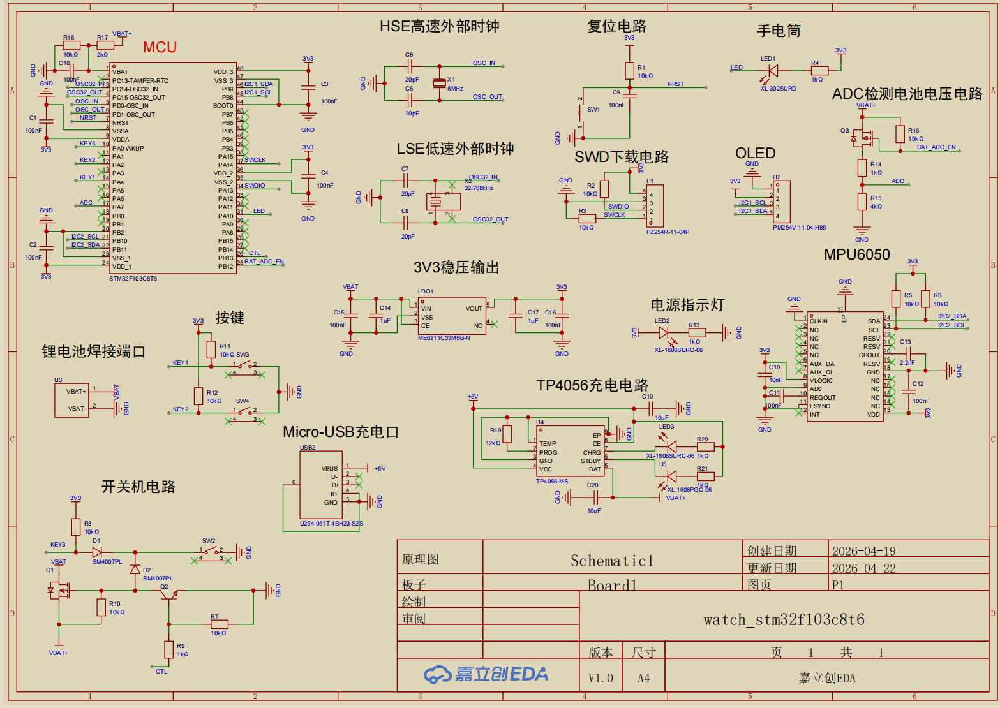

# STM32 Watch — 基于 STM32F103C8T6 的智能手表

基于 **STM32F103C8T6** 裸机开发的多功能智能手表，包含时间显示与设置、秒表、手电筒、姿态检测、小游戏、动态表情、水平仪、电池电量显示、开关机等功能。

参考项目：https://www.bilibili.com/video/BV1CoGuzEEeN/

效果视频：https://www.bilibili.com/video/BV1TEJw6qEXQ/


## 项目概览

手表通过 OLED 屏幕显示信息，采用循环滑动菜单（7 项功能图标）进行导航，3 个按键完成所有交互。内置 RTC 实时时钟保持走时，MPU6050 提供姿态数据，ADC 采集电池电压。支持长按按键实现模拟开关机（控制外部供电电路）。

## 硬件平台

| 模块 | 型号 / 说明 | 引脚 |
|------|------------|------|
| 主控芯片 | STM32F103C8T6（LQFP48，72MHz） | — |
| 显示屏 | 0.96" OLED（软件 I2C） | SCL / SDA |
| 六轴传感器 | MPU6050（软件 I2C） | SCL / SDA |
| 按键 × 3 | 上翻 / 下翻 / 确认 | PA4 / PA2 / PA0 |
| LED 指示灯 | 手电筒功能 | PA10 |
| 电源控制 | LED 模拟开关机 | PB12 / PB13 |
| 电池电压检测 | ADC（电位器模拟） | PA7（ADC1_CH7） |
| 实时时钟 | STM32 内置 RTC（LSE 32.768kHz） | — |

## 软件架构

```
watch/
├── User/                       # 主程序
│   ├── main.c                  # 入口：外设初始化、主循环、TIM2 中断服务
│   ├── stm32f10x_it.c/h       # 中断向量表
│   └── stm32f10x_conf.h       # 外设库配置
├── Hardware/                   # 硬件驱动层
│   ├── OLED.c/h                # 0.96" OLED 显示驱动（软件 I2C）
│   ├── OLED_Data.c/h           # OLED 字模数据（ASCII + 中文 + 图标 + 菜单图片）
│   ├── MPU6050.c/h             # MPU6050 六轴传感器驱动（软件 I2C）
│   ├── MPU6050_Reg.h           # MPU6050 寄存器地址定义
│   ├── MyI2C.c/h               # 软件 I2C 通用实现
│   ├── Key.c/h                 # 三键输入（含消抖 + 长按检测）
│   ├── LED.c/h                 # LED 控制（手电筒 + 电源模拟）
│   ├── AD.c/h                  # ADC 采集（电池电压）
│   ├── SetTime.c/h             # 时间设置界面（年/月/日/时/分/秒）
│   └── menu.c/h                # 主菜单、功能入口、各功能 UI 逻辑
├── Game/                       # 游戏模块
│   └── dino.c/h                # 小恐龙跑酷游戏
├── System/                     # 系统基础模块
│   ├── MyRTC.c/h               # RTC 实时时钟（读写 + 掉电保持）
│   ├── Timer.c/h               # TIM2 定时器初始化（10ms 中断）
│   └── Delay.c/h               # 延时函数
├── Start/                      # STM32 启动文件 + CMSIS
│   ├── startup_stm32f10x_md.s  # 启动汇编
│   ├── stm32f10x.h             # 寄存器定义
│   ├── system_stm32f10x.c/h    # 系统时钟配置
│   └── core_cm3.c/h            # Cortex-M3 内核
├── Library/                    # STM32 标准外设库
├── images/                     # 项目图片
│   ├── watch1.jpg              # 界面效果 1
│   ├── watch2.jpg              # 界面效果 2
│   └── HardwareSchematic.png   # 硬件原理图
├── Project.uvprojx             # Keil 工程文件
├── LICENSE                     # MIT License
└── readme.md
```

## 功能模块

### 1. 时钟显示（首页）

- 显示日期（年-月-日）和时间（时:分:秒）
- 底部显示"菜单"和"设置"两个选项，按键左右切换
- 右上角电池图标 + 电量百分比
- 通过 STM32 内置 RTC 保持走时，掉电由纽扣电池供电不丢失

### 2. 时间设置

- 支持分别设置：年、月、日、时、分、秒
- 按键上翻/下翻调整数值，自动循环（如月份 12→1→2）
- 确认后写入 RTC 寄存器

### 3. 循环滑动菜单

- 7 个功能图标横向排列，按键切换时带平滑滑动动画
- 中心选中项带边框高亮，左右预览相邻图标
- 菜单项：时间设置 / 秒表 / 手电筒 / 姿态检测 / 游戏 / 表情 / 水平仪

### 4. 秒表计时

- 精确到 10ms（TIM2 中断驱动）
- 支持开始、暂停、归零操作
- 退出后可后台继续计时

### 5. 手电筒（LED 控制）

- ON / OFF 两个选项，控制 PA10 引脚 LED

### 6. MPU6050 姿态检测

- 实时显示 Roll（X 轴）、Pitch（Y 轴）、Yaw（Z 轴）角度
- 互补滤波融合加速度计与陀螺仪数据
- Yaw 轴死区过滤，静止时抑制漂移

### 7. 小恐龙跑酷游戏

- 经典 Chrome Dino 游戏复刻
- 按键控制跳跃，躲避随机生成的障碍物
- 正弦函数控制跳跃轨迹，碰撞检测判定游戏结束
- 地面滚动动画 + 云朵装饰

### 8. 动态表情包

- 眉毛上下浮动 + 眼睛缩放动画
- 嘴巴静态显示，组合成眨眼表情

### 9. 水平仪

- 利用 MPU6050 姿态数据，绘制圆形水平泡
- 小球随手表倾斜实时偏移，直观显示水平状态

### 10. 电池电量显示

- ADC 采集电池电压（PA7），3000 次采样取平均值
- 电压范围 2.6V~3.3V 映射为 0%~100%
- 电池图标动态填充

### 11. 开关机功能

- **开机**：长按确认键（Key3）2 秒，PB12 拉低、PB13 拉高，接通电源
- **关机**：长按确认键（Key3）4 秒，PB12 拉高、PB13 拉低，断开电源
- 关机状态下屏蔽所有按键输入

## 定时器中断

TIM2 配置为 10ms 周期中断，在中断服务函数中轮询：

```c
void TIM2_IRQHandler(void)  // 10ms 触发一次
{
    Key_Tick();          // 按键消抖（边沿检测）
    Key3_Tick();         // Key3 长按检测（2s 开机 / 4s 关机）
    StopWatch_Tick();    // 秒表计时
    Dino_Tick();         // 游戏帧更新
}
```

## 按键交互

| 按键 | 引脚 | 功能 |
|------|------|------|
| 上翻 | PA4 | 菜单上移 / 数值增加 |
| 下翻 | PA2 | 菜单下移 / 数值减少 |
| 确认 | PA0 | 进入选中项 / 确认操作；长按 2s 开机 / 长按 4s 关机 |

按键采用定时器中断边沿检测消抖：每 10ms 采样一次状态，检测到按下→松开的边沿时触发按键事件。

## 开发环境

- **IDE**: Keil MDK-ARM V5
- **固件库**: STM32F10x 标准外设库
- **开发方式**: 裸机（无 RTOS）
- **时钟配置**: HSE 8MHz → PLL ×9 → SYSCLK 72MHz
- **RTC 时钟**: LSE 32.768kHz

## 编译与烧录

1. 使用 Keil MDK 打开 `Project.uvprojx`
2. 编译工程
3. 通过 ST-Link 烧录至 STM32F103C8T6

> **注意**：首次烧录后 RTC 时间需要手动设置。若 LSE 无法起振导致程序卡死，可参考 `MyRTC.c` 中的注释，将 RTC 时钟源切换为 LSI。

## PCB 硬件

若需打印 PCB 板制作完整的手表，可参考硬件原理图：



## 许可证

[MIT License](LICENSE)

## 开发日志

2026
    4.13
        创建初始界面
        优化：使用时钟定时中断，每20ms识别一次按键，达到按键消抖的效果
    4.14
        创建时间设置界面
    4.15
        创建循环滑动菜单
    4.16
        1.完成计时功能
          完成led控制功能
        2.修复计时功能bug：重复退出计时功能会触发计时
    4.17
        1.完成MPU6050姿态解算功能
          利用死区过滤，让Yaw的值不在静止时自减
        2.制作一个小游戏：小恐龙
          修改oled驱动文件中的OLED_SetCursor函数，取消显存偏移，修复oled显示白边bug
    4.18
        1.完善动态表情包功能和水平仪功能
        2.更改key和led的引脚，方便ad引脚使用排线
        3.添加电量显示功能（使用ADC；用电位器模拟电量变化）和长按两秒确认键（key3）关机功能
    5.25
        完善led模拟开关机功能，将开机改为长按2秒key3，关机为长按4秒
